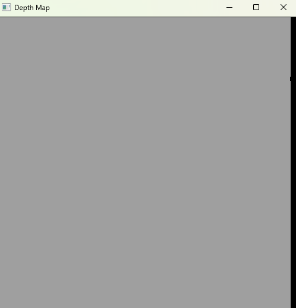

# Echo Sounding Simulator
[](https://github.com/matthew-buglass/echo_sounding_simulator/actions/workflows/python-test.yml)
[](https://www.python.org)

[//]: # (![Test Coverage]&#40;https://img.shields.io/endpoint?url=https://gist.githubusercontent.com/matthew-buglass/b88855f7e79729fc1cf9bd4b582012ba/raw/covbadge.json&#41;)

A simulator for taking echo sounding readings during bathymetric surveys. Code documentation can be found 
[here](https://matthew-buglass.github.io/echo_sounding_simulator/).

## Running the program
The simulator takes in a 3D object, like 
an `stl` file and samples across the surface, applying errors corresponding to the provided pipeline configuration. To
run the application, from the project root directory, run `pip install -r requirements.txt` then 
`python echo_sound_sim.py` with the appropriate arguments. The program assumes that the unit of the mesh is meters.

## CLI Arguments

```text
usage: echo_sound_sim.py [-h] [-p {parallel,drawn}] [-em EMITTER_TYPE] [-sr SAMPLE_RATE] [-e ERRORS [ERRORS ...]] [-vel VELOCITY] [--no-wait] data_file

positional arguments:
  data_file             An 3D data file to represent the surface to sample

options:
  -h, --help            show this help message and exit
  -p {parallel,drawn}, --path_type {parallel,drawn}
                        The type of search pattern to use over the mesh
  -em EMITTER_TYPE, --emitter_type EMITTER_TYPE
                        Where you want to emit the result vectors, if not to stdout. Your choices are: csv@<filename>, tsv@<filename>, endpoint@<url>
  -sr SAMPLE_RATE, --sample_rate SAMPLE_RATE
                        The rate (in Hertz) at which to sample the surface. Defaults to 1hz.
  -e ERRORS [ERRORS ...], --errors ERRORS [ERRORS ...]
                        A list describing the error introduction pipeline. Current formats: noise@0.05 - A random percent of noise present in a sensor. The   
                        value will be the 3-sigma level in a Gaussian distribution. fb@10 - A random rectangle representing a debris field with a specified   
                        square area that causes a false bottom reading. drop@0.01 - A random percent change that the sensor will dropout.
  -vel VELOCITY, --velocity VELOCITY
                        The velocity of the research vessel in m/s. Defaults to 1 m/s (3.6 km/hr)
  --no-wait             Flag to disable the waiting part off the simulation. If given, the sampling rate will remain the same, but the wait time between      
                        samples will be disabled.
```

### Path Type
This is the type of sampling that you would like to do. There are two options currently available, `parallel` and 
`drawn`. 

#### Parallel
A `parallel` track search will make a perfect zig-zag across the provided mesh. 

#### Drawn
The `drawn` option allows users to draw their desired path across the search space. After the mesh is read in, the user
is presented with a window of grey and black, representing a top-down projection of the search space. The grey pixels 
are where data exists for the mesh, and black is where data does not exist. After drawing the sample path a user can:

- Click in the window again to redraw the search path
- Close the window (the `X` in the top right corner)
- Close the application by pressing `q`

Once the sampling path is complete, the user is re-prompted with the search map but with the previously sampled 
datapoints coloured using a Viridis colour map; deeper is darker and shallower is lighter.

 
 


### Emitter Type
This declares how you want your sampled data to be emitted. The options are `csv`, `tsv`, or `endpoint`, but by default
the data will be printed to console.

#### CSV
The csv format will emit each datapoint as `x,y,z` coordinates into a csv file. The location is specified after the 
`@` symbol. So adding `-em csv@out.csv` will write the data to a file in the current directory named `out.csv`.

#### TSV
The tsv format will emit each datapoint as `x   y   z` coordinates into a csv file. The location is specified after the 
`@` symbol. So adding `-em tsv@out.tsv` will write the data to a file in the current directory named `out.tsv`.

#### Endpoint
The endpoint format will emit each datapoint as `x`, `y`, `z` coordinates into a provided endpoint. The endpoint is 
specified after the `@` symbol. So adding `-em endpoint@http://localhost:8000/` will perform a `PUT` request to a 
session with http://localhost:8000/ with the following payload:
```json
{
    "data": {
            "x": <X_COORDINATE>,
            "y": <Y_COORDINATE>,
            "z": <Z_COORDINATE>
        },
    "headers": {
        "Content-Type": "application/json",
        "Connection": "keep-alive"
    }
}
```

### Sample Rate
The sample rate represents at what rate the simulated sensor will read datapoints. The sample rate is measured in Hertz
(1Hz = 1 sample per second).

### Errors
The errors parameter declares the error pipeline to apply to the sensor.The possible errors that can be applied to
the mesh are:

- `noise`: Gaussian distributed noise profile
- `fb`: False bottom islands
- `drop`: Sensor drop-out

Errors are applied as a pipeline in the order that they are declared in the CLI, so you can have as many, or as few as
you would like. If no errors are declared, then the resulting data will be the true depth of the mesh. 

#### Noise
All sensors have a noise profile associated with their readings. In this simulator, we assume the noise is Normally 
distributed around the true depth with a percent standard deviation equal to one-third of the provided value. 
For example, if you were to use `-e noise@0.1`, then the noise profile of the sensor would $\pm$10% around the ture
depth at three standard deviations.

#### False Bottom
False bottom readings occur due to sensor malfunctions or debris floating in the water column. This simulator models 
debris fields as unmoving and persistent, so re-sampling an area will read the same depth. The number after the `@` is 
the area (in square meters) of the false bottom reading (island) that will be randomly placed in the search space. So 
if you were to specify `-e fb@20 fb@10`, then two islands, one $10m^2$ and one $20m^2$, will be randomly placed within
the search space.

#### Drop-out
Sensor dropouts occur when a sensor stops reading depths and records a `0` instead. This has been modeled with a 
stochastic trailing so that clusters of dropouts can happen together. So if a dropout happens, for the next few 
readings, there will be a higher chance of the sensor dropping out. The change of a dropout occurring is specified 
after the `@` symbol. For example, if you were to specify `-e drop@0.05` there is a base 5% chance of the sensor 
dropping out. Then, if a string of dropouts were to happen, the chances of a dropout on those subsequent readings would
be 10%, 7.5%, 6.25%, etc.

### Velocity
The velocity is the speed at which the vessel crosses the sample mesh. The velocity is in meters per second.

### No Wait
By default, the simulator will respect the Sample Rate parameter given to it and will only emit data on that cadence. 
So by default, with a sampling rate of 1Hz, a data point will be written every second. By adding the `--no-wait` flag,
the simulator will calculate the position of the sample according to the sample rate and velocity, but will perform 
that calculation and emit data as fast as it can.

### Wrapping it up
Say you were to run:

```shell
$ python echo_sound_sim.py test.stl -p drawn -e fb@30 fb@40 fb@50 noise@0.1 drop@0.01 -em csv@./out.csv --no-wait
```

Then the simulator will:

- Sample from `test.stl`
- Allow the user to draw their sample path
- Add a $30m^2$ false bottom island
- Add a $40m^2$ false bottom island
- Add a $50m^2$ false bottom island
- Add 10% sensor noise
- Add a 1% change of sensor dropout
- Write the data in a csv format to the file `./out.csv`
- Will calculate data as fast as it can
