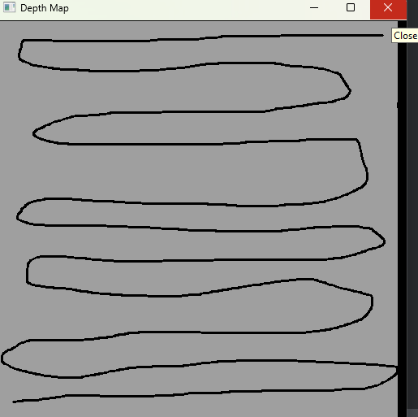

# Echo Sounding Simulator
[](https://github.com/matthew-buglass/echo_sounding_simulator/actions/workflows/python-test.yml)
[](https://www.python.org)

[//]: # (![Test Coverage]&#40;https://img.shields.io/endpoint?url=https://gist.githubusercontent.com/matthew-buglass/b88855f7e79729fc1cf9bd4b582012ba/raw/covbadge.json&#41;)

A simulator for taking echo sounding readings during bathymetric surveys. 

## Running the program
The simulator takes in a 3D object, like 
an `stl` file and samples across the surface, applying errors corresponding to the provided pipeline configuration. To
run the application, from the project root directory, run `pip install -r requirements.txt` then 
`python echo_sound_sim.py` with the appropriate arguments. The program assumes that the unit of the mesh is meters.

## CLI Arguments

```text
usage: echo_sound_sim.py [-h] [-p {parallel,drawn}] [-em EMITTER_TYPE] [-sr SAMPLE_RATE] [-e ERRORS [ERRORS ...]] [-vel VELOCITY] [--no-wait] data_file

positional arguments:
  data_file             An 3D data file to represent the surface to sample

options:
  -h, --help            show this help message and exit
  -p {parallel,drawn}, --path_type {parallel,drawn}
                        The type of search pattern to use over the mesh
  -em EMITTER_TYPE, --emitter_type EMITTER_TYPE
                        Where you want to emit the result vectors, if not to stdout. Your choices are: csv@<filename>, tsv@<filename>, endpoint@<url>
  -sr SAMPLE_RATE, --sample_rate SAMPLE_RATE
                        The rate (in Hertz) at which to sample the surface. Defaults to 1hz.
  -e ERRORS [ERRORS ...], --errors ERRORS [ERRORS ...]
                        A list describing the error introduction pipeline. Current formats: noise@0.05 - A random percent of noise present in a sensor. The   
                        value will be the 3-sigma level in a Gaussian distribution. fb@10 - A random rectangle representing a debris field with a specified   
                        square area that causes a false bottom reading. drop@0.01 - A random percent change that the sensor will dropout.
  -vel VELOCITY, --velocity VELOCITY
                        The velocity of the research vessel in m/s. Defaults to 1 m/s (3.6 km/hr)
  --no-wait             Flag to disable the waiting part off the simulation. If given, the sampling rate will remain the same, but the wait time between      
                        samples will be disabled.
```

### Path Type
This is the type of sampling that you would like to do. There are two options currently available, `parallel` and 
`drawn`. 

#### Parallel
A `parallel` track search will make a perfect zig-zag across the provided mesh. 

#### Drawn
The `drawn` option allows users to draw their desired path across the search space. After the mesh is read in, the user
is presented with a window of grey and black, representing a top-down projection of the search space. The grey pixels 
are where data exists for the mesh, and black is where data does not exist. After drawing the sample path a user can:

- Click in the window again to redraw the search path
- Close the window (the `X` in the top right corner)
- Close the application by pressing `q`

Once the sampling path is complete, the user is re-prompted with the search map but with the previously sampled 
datapoints coloured using a Viridis colour map; deeper is darker and shallower is lighter.

 
 


### Emitter Type
This declares how you want your sampled data to be emitted. The options are `csv`, `tsv`, or `endpoint`.

#### CSV

#### TSV

#### Endpoint

### Sample Rate

### Errors

### Velocity

### No Wait